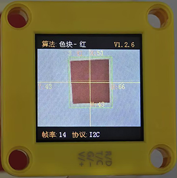
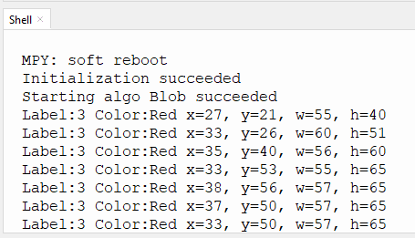

# 4.2 色块检测

## 4.2.1 算法简介



指定某种检测颜色，判断图像中是否有该颜色的色块，返回其坐标和大小，颜色分类标签与颜色识别中的定义相同。

---------------------------

## 4.2.2 配置参数

用户可指定待识别色块检测的，大小和颜色标签，参数定义如下：（只能识别一个颜色）

代码：

```python
#通过'#'符号注释的方式选择要识别的颜色快
#sengo1.SetParam(sengo1_vision_e.kVisionBlob,[0, 0, 6, 6, color_label_e.kColorBlack], 1)  #黑色
#sengo1.SetParam(sengo1_vision_e.kVisionBlob,[0, 0, 6, 6, color_label_e.kColorWhite], 1)  #白色
sengo1.SetParam(sengo1_vision_e.kVisionBlob,[0, 0, 6, 8, color_label_e.kColorRed], 1)    #红色
#sengo1.SetParam(sengo1_vision_e.kVisionBlob,[0, 0, 6, 8, color_label_e.kColorGreen], 1)  #绿色
#sengo1.SetParam(sengo1_vision_e.kVisionBlob,[0, 0, 8, 8, color_label_e.kColorBlue], 1)   #蓝色
#sengo1.SetParam(sengo1_vision_e.kVisionBlob,[0, 0, 8, 6, color_label_e.kColorYellow], 1) #黄色
```

-------------------

## 4.2.3 返回数据

主控器获取检测结果时，算法会返回以下数据：

|     形参     |      含义       |
| :----------: | :-------------: |
|   kXValue    | 色块中心横坐标x |
|   kYValue    | 色块中心纵坐标y |
| kWidthValue  |    色块宽度w    |
| kHeightValue |    色块高度h    |
|    kLabel    |  颜色分类标签   |

代码：

```python
        #读取色块坐标以及尺寸
        x = sengo1.GetValue(sengo1_vision_e.kVisionBlob, sentry_obj_info_e.kXValue)
        y = sengo1.GetValue(sengo1_vision_e.kVisionBlob, sentry_obj_info_e.kYValue)
        w = sengo1.GetValue(sengo1_vision_e.kVisionBlob, sentry_obj_info_e.kWidthValue)
        h = sengo1.GetValue(sengo1_vision_e.kVisionBlob, sentry_obj_info_e.kHeightValue)
        #读取色块颜色标签值
        label = sengo1.GetValue(sengo1_vision_e.kVisionBlob,sentry_obj_info_e.kLabel)
```

---------------------

## 4.2.4 代码

```python
from machine import I2C,UART,Pin
from  Sengo1  import *
import time
import random

color_Name = [" ","Black","Whiet","Red","Green","Blue","Yellow"]

# 等待Sengo1完成操作系统的初始化。此等待时间不可去掉，避免出现Sengo1尚未初始化完毕主控器已经开发发送指令的情况
time.sleep(3)

# 选择UART或者I2C通讯模式，Sengo1出厂默认为I2C模式，短按模式按键可以切换
# 4种UART通讯模式：UART9600（标准协议指令），UART57600（标准协议指令），UART115200（标准协议指令），Simple9600（简单协议指令），
# 参看“简单协议指令”
# port = UART(2,rx=Pin(16),tx=Pin(17),baudrate=9600)
port = I2C(0,scl=Pin(22),sda=Pin(21),freq=400000)

# Sengo1通讯地址：0x60。如果I2C总线挂接多个设备，请避免出现地址冲突
sengo1 = Sengo1(0x60)


err = sengo1.begin(port)
if err != SENTRY_OK:
    print(f"Initialization failed，error code:{err}")
else:
    print("Initialization succeeded")


#通过'#'符号注释的方式选择要识别的颜色快
#sengo1.SetParam(sengo1_vision_e.kVisionBlob,[0, 0, 6, 6, color_label_e.kColorBlack], 1)  #黑色
#sengo1.SetParam(sengo1_vision_e.kVisionBlob,[0, 0, 6, 6, color_label_e.kColorWhite], 1)  #白色
sengo1.SetParam(sengo1_vision_e.kVisionBlob,[0, 0, 6, 8, color_label_e.kColorRed], 1)    #红色
#sengo1.SetParam(sengo1_vision_e.kVisionBlob,[0, 0, 6, 8, color_label_e.kColorGreen], 1)  #绿色
#sengo1.SetParam(sengo1_vision_e.kVisionBlob,[0, 0, 8, 8, color_label_e.kColorBlue], 1)   #蓝色
#sengo1.SetParam(sengo1_vision_e.kVisionBlob,[0, 0, 8, 6, color_label_e.kColorYellow], 1) #黄色

# 等待新参数生效后的识别结果产出，该时间间隔不得低于该算法识别1帧所花费的时间，可以通过算法开启后，屏幕下方的帧率进行推算
time.sleep(0.1)

#正常使用时，应由主控板发送指令控制Sengo1的算法开启关闭，而不是通过Sengo1的摇杆进行操作；
err = sengo1.VisionBegin(sengo1_vision_e.kVisionBlob)
if err != SENTRY_OK:
    print(f"Starting algo Blob failed，error code:{err}")
else:
    print("Starting algo Blob succeeded")


while True:
    # Sengo1不主动返回检测识别结果，需要主控板发送指令进行读取。读取的流程：首先读取识别结果的数量，接收到指令后，Sengo1会刷新结果数据，如果结果数量不为零，那么主控再发送指令读取结果的相关信息。请务必按此流程构建程序。
    obj_num = sengo1.GetValue(sengo1_vision_e.kVisionBlob, sentry_obj_info_e.kStatus)
    if obj_num:
        #读取色块坐标以及尺寸
        x = sengo1.GetValue(sengo1_vision_e.kVisionBlob, sentry_obj_info_e.kXValue)
        y = sengo1.GetValue(sengo1_vision_e.kVisionBlob, sentry_obj_info_e.kYValue)
        w = sengo1.GetValue(sengo1_vision_e.kVisionBlob, sentry_obj_info_e.kWidthValue)
        h = sengo1.GetValue(sengo1_vision_e.kVisionBlob, sentry_obj_info_e.kHeightValue)
        #读取色块颜色标签值
        label = sengo1.GetValue(sengo1_vision_e.kVisionBlob,sentry_obj_info_e.kLabel)
        #打印色块标签值与颜色名称
        print(f"Label:{label} Color:{color_Name[label]}",end='')
        #打印色块坐标与尺寸
        print(" x=%d, y=%d, w=%d, h=%d"%(x, y, w, h))
        time.sleep(0.2)  


```

----------------------------

## 4.2.5 代码结果

上传代码后，AI视觉模块将会对摄像头拍到的地方进行分析如果有红色块就会进行框选标记，并且再串口监视器中打印色块的颜色标签值（颜色标签值与“4.1 颜色识别课程中一致”）与颜色名称以及坐标和尺寸。




