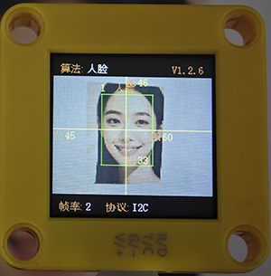
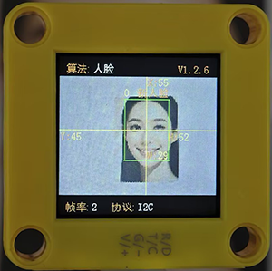
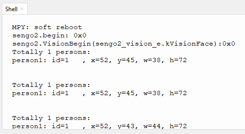

# 4.7 人脸识别

## 4.7.1 算法简介



判断图像中是否有人脸及识别人脸，用户可通过功能按键训练存储或删除人脸数据，Sengo1可以存储10张人脸数据。

-----------------

## 4.7.2 人脸分类标签

Sengo1定义了11个人脸的分类标签：

| 分类标签 |  含义  | 分类标签 |        含义        |
| :------: | :----: | :------: | :----------------: |
|    0     | 新人脸 |   1-10   | 存储的人脸分类编号 |

新人脸（标签 0）：



存储的人脸（标签 1-10）


---------------

## 4.7.3 保存人脸数据

开启人脸识别算法后，将摄像头正对人脸，按下功能按键约5秒后松开，Sengo1开始训练人脸，图像中当前的人脸数据会被存储并分配一个ID编号。

人脸数据的编号即标签值的分配原则：当前可用编号中最小的号。如果无空余编号，则Sengo1会提示保存失败。

----------------

## 4.7.4 删除人脸数据

执行完毕人脸存储操作后，按下功能按键约10秒后松开，即可删除刚存储的人脸数据；再次按下10秒后，则会清空存储的全部人脸数据。若算法开启后未执行过人脸保存操作，则下功能按键10秒后会直接清空全部的人脸数据。

------------------

## 4.7.5 返回数据

主控器获取识别结果时，算法会返回以下数据：

|     参数     |      含义       |
| :----------: | :-------------: |
|   kXValue    | 人脸中心横坐标x |
|   kYValue    | 人脸中心纵坐标y |
| kWidthValue  |    人脸宽度w    |
| kHeightValue |    人脸高度h    |
|    kLabel    |  人脸分类标签l  |

代码：

```python
        #读取人脸标签 1-10是存储的人脸数据，0是没有存储的陌生人脸
        l = sengo1.GetValue(sengo1_vision_e.kVisionFace,sentry_obj_info_e.kLabel)
        #人脸位置数据x
        x = sengo1.GetValue(sengo1_vision_e.kVisionFace, sentry_obj_info_e.kXValue)
        #人脸位置数据y
        y = sengo1.GetValue(sengo1_vision_e.kVisionFace, sentry_obj_info_e.kYValue)
        #人脸尺寸（宽度）数据w
        w = sengo1.GetValue(sengo1_vision_e.kVisionFace, sentry_obj_info_e.kWidthValue)
        #人脸尺寸(高度)数据h
        h = sengo1.GetValue(sengo1_vision_e.kVisionFace, sentry_obj_info_e.kHeightValue)
```

---------------

## 4.7.6 使用技巧

1. 环境光线充足，正对人脸且完整的人脸在视野中较大时识别效果佳
2. 佩戴眼镜或头发遮住面部时，会影响人脸检测效果

----------------

## 4.7.7 代码

```python
from machine import I2C,UART,Pin
from  Sengo1  import *
import time

# 等待Sengo1完成操作系统的初始化。此等待时间不可去掉，避免出现Sengo1尚未初始化完毕主控器已经开发发送指令的情况
time.sleep(3)

# 选择UART或者I2C通讯模式，Sengo1出厂默认为I2C模式，短按模式按键可以切换
# 4种UART通讯模式：UART9600（标准协议指令），UART57600（标准协议指令），UART115200（标准协议指令），Simple9600（简单协议指令），
# port = UART(2,rx=Pin(16),tx=Pin(17),baudrate=9600)
port = I2C(0,scl=Pin(22),sda=Pin(21),freq=400000)

# Sengo1通讯地址：0x60。如果I2C总线挂接多个设备，请避免出现地址冲突
sengo1 = Sengo1(0x60)


err = sengo1.begin(port)
if err != SENTRY_OK:
    print(f"Initialization failed，error code:{err}")
else:
    print("Initialization succeeded")

# 1、Sengo1的人脸识别算法可以存储并识别10张人脸，对应的label值：1-10；
# 2、陌生人人脸的label值为0；
# 3、可以通过摇杆进行人脸的学习以及数据删除，也可以参照本程序用代码进行实现；
# 4、人脸识别算法的常见应用：门禁系统；智能家居；智能交通灯
# 5、Sengo1每次只能运行一种识别算法；
# 6、通常情况下应当由主控板发送指令控制Sengo1算法的开启与关闭，而不是通过Sengo1的摇杆进行操作；
err = sengo1.VisionBegin(sengo1_vision_e.kVisionFace)
if err != SENTRY_OK:
    print(f"Starting algo Face failed，error code:{err}")
else:
    print("Starting algo Face succeeded")


while True:
    # Sengo1不主动返回检测识别结果，需要主控板发送指令进行读取。读取的流程：首先读取识别结果的数量，接收到指令后，Sengo1会刷新结果数据，如果结果数量不为零，那么主控再发送指令读取结果的相关信息。请务必按此流程构建程序。
    obj_num = sengo1.GetValue(sengo1_vision_e.kVisionFace, sentry_obj_info_e.kStatus)
    if obj_num:
        #读取人脸标签 1-10是存储的人脸数据，0是没有存储的陌生人脸
        l = sengo1.GetValue(sengo1_vision_e.kVisionFace,sentry_obj_info_e.kLabel)
        #人脸位置数据x
        x = sengo1.GetValue(sengo1_vision_e.kVisionFace, sentry_obj_info_e.kXValue)
        #人脸位置数据y
        y = sengo1.GetValue(sengo1_vision_e.kVisionFace, sentry_obj_info_e.kYValue)
        #人脸尺寸（宽度）数据w
        w = sengo1.GetValue(sengo1_vision_e.kVisionFace, sentry_obj_info_e.kWidthValue)
        #人脸尺寸(高度)数据h
        h = sengo1.GetValue(sengo1_vision_e.kVisionFace, sentry_obj_info_e.kHeightValue)
        #输出人脸数据
        print("person: id=%d, x=%d, y=%d, w=%d, h=%d"%(l, x, y, w, h))
        time.sleep(0.2)
        

```

--------------------

## 4.7.8 代码结果

上传代码后，按住AI视觉模块后面的功能按键并保持5秒然后对准人脸等待一会学习完毕后就可以对物体进行识别了，当遇到新的人脸也是会提示的。


