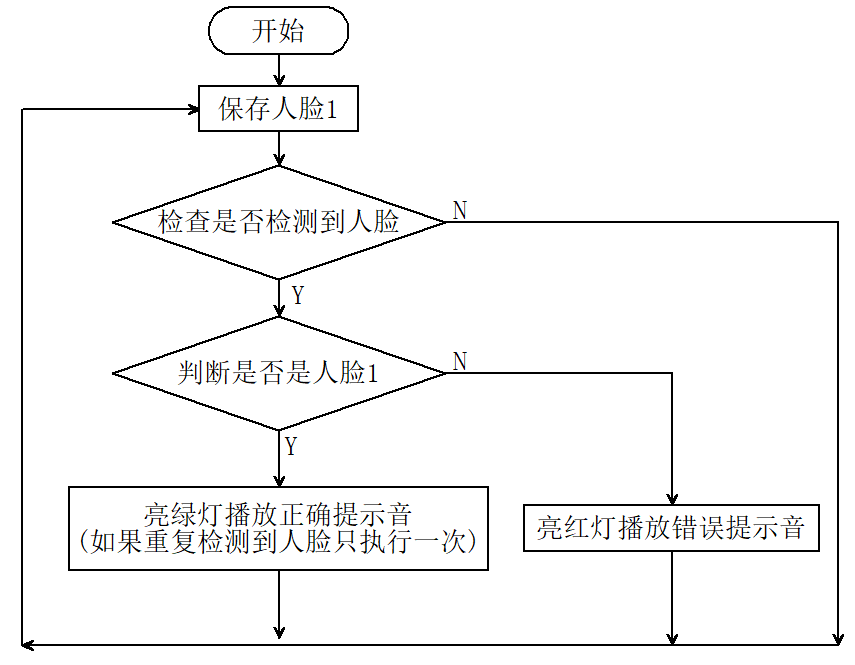

# 5.1 人脸解锁

## 5.1.1 简介

人脸识别解锁，判断是否是存储好的人脸，是则播放正确提示音亮绿灯，不是则播放错误提示音亮红灯。通过长按AI视觉模块的功能按键进行训练并存储人脸，然后通过代码对该人脸进行判断。

## 5.1.2 代码流程图



## 5.1.3 代码

```python
from machine import I2C, UART, Pin, PWM
from Sengo1 import *
import time
import neopixel

# 1. 硬件初始化
# 等待Sengo1完成操作系统的初始化
time.sleep(3) 

# I2C 初始化
port = I2C(0, scl=Pin(22), sda=Pin(21), freq=400000)

# Sengo1 初始化
sengo1 = Sengo1(0x60)
err = sengo1.begin(port)
print("sengo1.begin: 0x%x" % err)

# 【重要】检查初始化是否成功
if err != 0:
    print("ERROR: Sengo1 initialization failed!")
    # 如果失败，蜂鸣器长响报警，程序停止
    buzzer_err = PWM(Pin(2, Pin.OUT))
    buzzer_err.freq(1000)
    buzzer_err.duty_u16(32768)
    while True:
        time.sleep(1)

# 开启人脸识别模式
err = sengo1.VisionBegin(sengo1_vision_e.kVisionFace)
print("sengo1.VisionBegin: 0x%x" % err)

# 2. 蜂鸣器初始化
buzzer = PWM(Pin(2, Pin.OUT))
buzzer.freq(1000)     # 设置默认频率
buzzer.duty_u16(0)    # 确保启动时蜂鸣器是关闭的

# 3. NeoPixel 初始化
pin = Pin(14, Pin.OUT)
np = neopixel.NeoPixel(pin, 4)
# 初始化熄灭所有灯
for j in range(4):
    np[j] = (0, 0, 0)
np.write()

# 变量定义
brightness = 100
colors = [
    (brightness, 0, 0),                    # 红
    (0, brightness, 0),                    # 绿
    (0, 0, brightness),                    # 蓝
    (brightness, brightness, brightness),  # 白
    (0, 0, 0)                              # 关闭
]

previousMillis = 0
lastDetectionTime = 0
disappearDelay = 5000  # 5秒
currentFaceDetected = False

def play_success_sound():
    """正确提示音"""
    for i in range(2):
        buzzer.freq(1500)
        buzzer.duty_u16(32768)
        time.sleep_ms(100)
        buzzer.duty_u16(0)
        time.sleep_ms(50)

def play_error_sound():
    """错误提示音"""
    buzzer.freq(300)
    buzzer.duty_u16(32768)
    time.sleep_ms(500)
    buzzer.duty_u16(0)  # 确保结束后关闭

print("System Ready. Waiting for faces...")

while True:
    # 读取状态
    obj_num = sengo1.GetValue(sengo1_vision_e.kVisionFace, sentry_obj_info_e.kStatus)
    currentMillis = time.ticks_ms()
    
    if obj_num:        
        # 获取标签
        l = sengo1.GetValue(sengo1_vision_e.kVisionFace, sentry_obj_info_e.kLabel)
        
        # 识别到已注册的人脸 (Label 1-10)
        if 1 <= l <= 10 and not currentFaceDetected:
            lastDetectionTime = currentMillis
            currentFaceDetected = True
            
            # 绿灯闪烁
            for j in range(4):
                np[j] = colors[1] # 绿
            np.write()
            
            play_success_sound()
            
            # 熄灭
            for j in range(4):
                np[j] = colors[4] # 灭
            np.write()
            
        # 识别到陌生人 (Label 0)
        elif l == 0:
            # 红灯闪烁
            for j in range(4):
                np[j] = colors[0] # 红
            np.write()
            
            play_error_sound()
            
            # 熄灭
            for j in range(4):
                np[j] = colors[4] # 灭
            np.write()
            
    # 短暂延时，避免总线占用过高
    time.sleep_ms(300)
    
    # 重置检测状态
    if currentFaceDetected and (time.ticks_diff(currentMillis, lastDetectionTime) >= disappearDelay):
        currentFaceDetected = False


```

## 5.1.4 代码结果

上传代码成功后，AI视觉模块就会对摄像头拍到的画面进行人脸识别，如果画面中出现人脸则将这个人脸与我们保存的标签号为"1"的人脸进行对比，从而判断是不是标签号为"1"的人脸， 是则小车发出正确提示音并且亮绿灯，不是则小车发出错误提示音并且亮红灯。