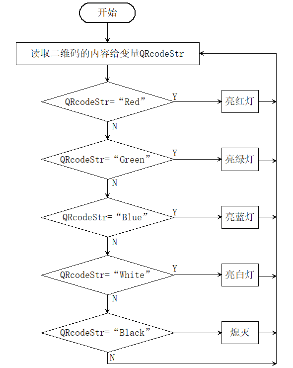

# 5.4 二维码控制车灯

## 5.4.1 简介

二维码控制车灯，AI视觉模块对二维码进行识别然后通过二维码的内容进行设置WS2812灯珠显示的颜色分别有：红色，绿的，蓝色，黑色（熄灭），白色，因为我们提供的二维码就是这些内容，你也可以根据`4.9 二维码识别`教程的方法自己生成想要二维码。

## 5.4.2 流程图 



## 5.4.3 代码

```python
from machine import I2C, Pin
from Sengo1 import *
import time
from neopixel import NeoPixel

# wait for Sengo1 initialization (important!)
time.sleep(3)

# I2C for Sengo1 (ESP32 hardware I2C0)
port = I2C(0, scl=Pin(22), sda=Pin(21), freq=400000)

sengo1 = Sengo1(0x60)
err = sengo1.begin(port)
print("sengo1.begin: 0x%x" % err)

# start QR code recognition
err = sengo1.VisionBegin(sengo1_vision_e.kVisionQrCode)
print("sengo1.VisionBegin(sengo1_vision_e.kVisionQrCode):0x%x" % err)

# Neopixel setup (ESP32 compatible with brightness wrapper)
NUM_LEDS = 4
NEOPIXEL_PIN = 14

class myNeopixel(NeoPixel):
    def __init__(self, num_leds, pin, brightness=255):
        super().__init__(Pin(pin), num_leds)
        self._brightness = brightness

    def brightness(self, val):
        self._brightness = val

    def fill(self, r, g, b):
        r = int(r * self._brightness / 255)
        g = int(g * self._brightness / 255)
        b = int(b * self._brightness / 255)
        super().fill((r, g, b))

    def show(self):
        self.write()

np = myNeopixel(NUM_LEDS, NEOPIXEL_PIN)
np.brightness(150)

lastDetectionTime = 0

while True:
    obj_num = sengo1.GetValue(sengo1_vision_e.kVisionQrCode, sentry_obj_info_e.kStatus)
    currentMillis = time.ticks_ms()

    if obj_num:
        lastDetectionTime = currentMillis
        QRcodeStr = sengo1.GetQrCodeString()
        if QRcodeStr == "Red":
            np.fill(255, 0, 0)
            np.show()
        elif QRcodeStr == "Green":
            np.fill(0, 255, 0)
            np.show()
        elif QRcodeStr == "Blue":
            np.fill(0, 0, 255)
            np.show()
        elif QRcodeStr == "Black":
            np.fill(0, 0, 0)
            np.show()
        elif QRcodeStr == "White":
            np.fill(255, 255, 255)
            np.show()

    # turn off LEDs if no QR code detected for 5 seconds
    if time.ticks_diff(currentMillis, lastDetectionTime) >= 5000:
        lastDetectionTime = currentMillis
        np.fill(0, 0, 0)
        np.show()

    time.sleep(0.1)  # small delay to avoid busy loop


```

## 5.4.4 代码结果

上传代码成功后，AI视觉模块会对拍到的画面进行识别，判断是否有二维码，如果有便将二维码的内容进行赋值给变量，然后通过变量进行判断是否是对应的内容，内容"Red"亮红灯，内容"Green"亮绿灯，内容"Blue"亮蓝灯，内容"White"亮白灯，内容"Black"熄灭灯。