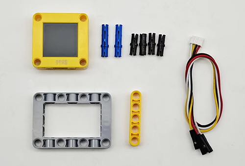

# 5.5 智能投石车

## 5.5.1 简介

使用AI视觉模块搭配小车的投石攻城车造型，制作出有趣的自动识别投石器，先将AI视觉模块固定到投石器小车上，然后使用AI模块进行识别如果识别到了人体就蜂鸣器开始倒计时3声然后投掷，投掷结束后缓慢落下投掷臂等待下一次识别到人体后投掷。

## 5.5.2 将AI模块安装到投石小车上

<p style="color:red;font-size:25px;">注意：你需要先按照小车教程将`投石攻城车`的乐高搭建好，然后再按照下方的安装教程进行安装。</p>

**所需配件**



**步骤1：**


**步骤2：**


**步骤3：**


**步骤4：**

|  AI视觉模块  | 小车接口 |
| :----------: | :------: |
| T/C (黄色线) |   SCL    |
| R/D (白色线) |   SDA    |
| V/+ (红色线) |    5V    |
| G/- (黑色线) |    G     |


**完整展示：**


## 5.5.3 流程图


## 5.5.4 代码

```python
from machine import I2C, Pin, PWM
from Sengo1 import *               # 请确保 Sengo1.py 已保存在 ESP32 中
import time

# ---------- 硬件引脚定义（ESP32 可自由映射） ----------
# 注意：GPIO3 在 ESP32 上是 UART0 的 RX，烧录/调试时可能受影响，
#       实际接线时可改为其他可用引脚（如 GPIO4）。
servo = PWM(Pin(23), freq=50)       # 舵机，50Hz
servo.duty_u16(0)                 # 也建议关闭以避免舵机上电抖动
# GPIO12 在 ESP32 启动时是 MTDI 引脚，最好外接下拉保证启动，或改为其他引脚
buzzer = PWM(Pin(2), freq=800)   # 可先给定一个默认频率
buzzer.duty_u16(0)                # 立即关闭

# ---------- 等待 Sengo1 初始化 ----------
time.sleep(3)                      # 不可省略

# ---------- I2C 通信（Sengo1 默认 I2C 模式） ----------
# ESP32 硬件 I2C0，可任意指定 SCL/SDA
port = I2C(0, scl=Pin(22), sda=Pin(21), freq=400000)

sengo1 = Sengo1(0x60)
err = sengo1.begin(port)
print("sengo1.begin: 0x%x" % err)

# 开启人体检测算法
err = sengo1.VisionBegin(sengo1_vision_e.kVisionBody)
print("sengo1.VisionBegin(sengo1_vision_e.kVisionBody):0x%x" % err)


# ---------- 蜂鸣器发声函数 ----------
def tone(pwm_pin, frequency, duration):
    """发出指定频率的声音，持续 duration 毫秒"""
    if frequency > 0:
        pwm_pin.freq(frequency)
        pwm_pin.duty_u16(32768)      # 50% 占空比
    time.sleep_ms(duration)
    pwm_pin.duty_u16(0)             # 停止发声

def no_tone(pwm_pin):
    pwm_pin.duty_u16(0)


# ---------- 倒计时提示音 ----------
def countdown(seconds):
    for i in range(seconds, 0, -1):
        tone(buzzer, 800, 100)      # 滴声
        time.sleep_ms(200)
        no_tone(buzzer)
        time.sleep_ms(500)          # 间隔


# ---------- 舵机角度控制（0 ~ 270 度） ----------
def set_servo_angle(angle):
    if angle < 0:
        angle = 0
    elif angle > 270:
        angle = 270

    # 270 度舵机：0.5ms ~ 2.5ms 对应 0 ~ 270 度
    min_duty = 1638                  # (0.5 / 20) * 65535
    max_duty = 8192                  # (2.5 / 20) * 65535
    duty = int(min_duty + (max_duty - min_duty) * angle / 270)
    servo.duty_u16(duty)


# ---------- 主循环：人体检测 → 倒计时 → 投放 ----------
while True:
    # 获取检测到的人体数量
    obj_num = sengo1.GetValue(sengo1_vision_e.kVisionBody, sentry_obj_info_e.kStatus)

    if obj_num:
        # 倒计时三声
        countdown(3)

        # 投放动作：舵机转到 90 度
        set_servo_angle(90)
        time.sleep(1)

        # 缓慢回落至 0 度
        for angle in range(90, 0, -1):
            set_servo_angle(angle)
            time.sleep(0.01)

    time.sleep(0.1)                 # 循环间隔，降低 CPU 占用

```

## 5.5.5 代码结果

上传代码成功后，AI视觉模块会开启“人体识别”模式然后对拍到的画面进行识别，判断是否有检测到人体，如果有则进行投掷，投掷前会有三声倒计时提示音倒计时结束就会进行投掷，投掷完成后投掷臂会慢慢的回落等待下一次投掷。这样就完成了一个防盗装置。
