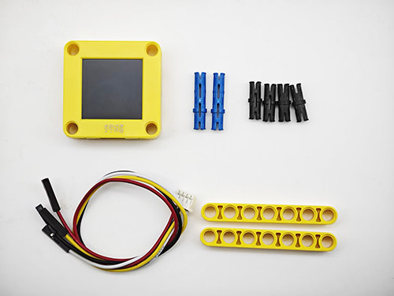
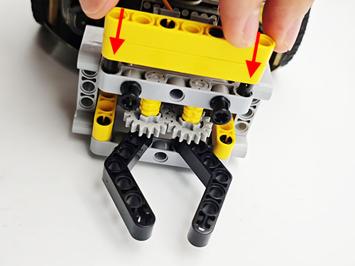
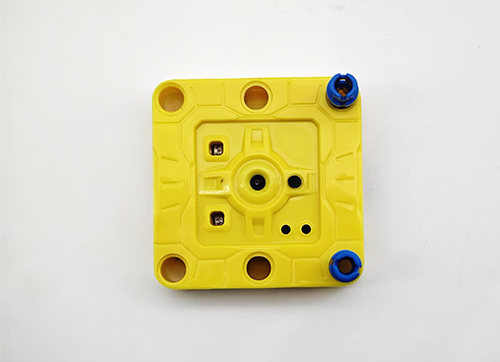
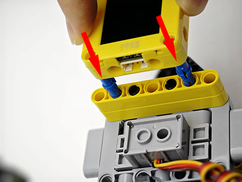
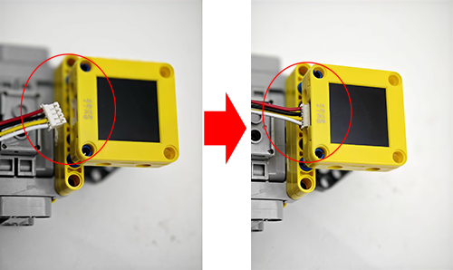
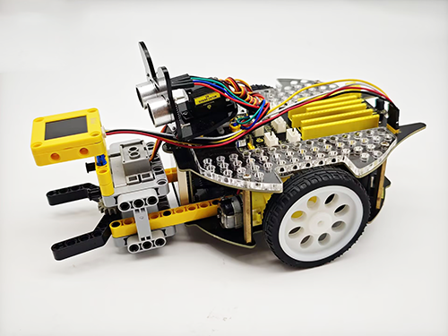
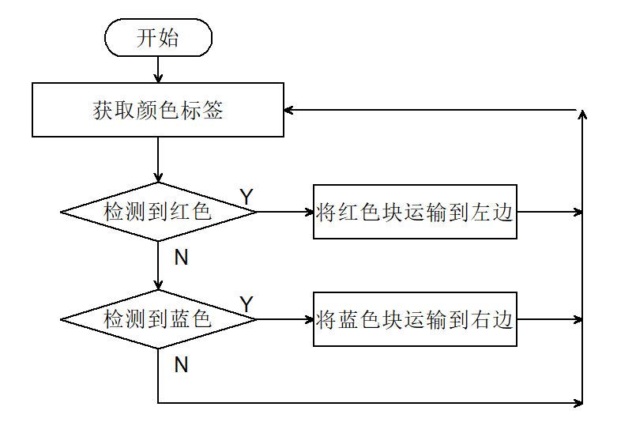

# 5.6 红蓝颜色分拣车

## 5.6.1 简介

使用AI视觉模块搭配小车的足球机器人造型，制作出有趣的色块分拣机器人，先将AI视觉模块固定到足球机器人小车上，然后使用AI模块进行识别，如果识别到了红色块就运输到左边然后原路返回原位，如果识别到蓝色则运输到右边再原路返回到原位。

## 5.6.2 将AI模块安装到足球小车上

<p style="color:red;font-size:25px;">注意：你需要先按照小车教程将`足球机器人`的乐高搭建好，然后再按照下方的安装教程进行安装。</p>

 **所需配件：**



**步骤1：**


**步骤2：**



**步骤3：**



**步骤4：**



**步骤5：**



**步骤6：**

|  AI视觉模块  | 小车接口 |
| :----------: | :------: |
| T/C (黄色线) |   SCL    |
| R/D (白色线) |   SDA    |
| V/+ (红色线) |    5V    |
| G/- (黑色线) |    G     |


**完整展示：**




## 5.6.3 流程图




## 5.6.4 代码

```python
from machine import I2C, Pin, PWM
import time
from Sengo1 import *

# ---------- 舵机初始化 (GPIO23) ----------
servo = PWM(Pin(23), freq=50)
servo.duty_u16(0)          # 上电后立即关闭，防止乱动

# ---------- I²C 初始化（Sengo1 视觉模块）----------
port = I2C(0, scl=Pin(22), sda=Pin(21), freq=400000)

# 等待 Sengo1 上电完成（时间不能太短）
time.sleep(2)

# 创建 Sengo1 对象（默认 I²C 地址 0x60）
sengo1 = Sengo1(0x60)

err = sengo1.begin(port)
if err != SENTRY_OK:
    print(f"Initialization failed, error code:{err}")
else:
    print("Initialization succeeded")

# 颜色识别功能配置
sengo1.SetParam(sengo1_vision_e.kVisionColor, [50, 50, 20, 20, 1])
time.sleep(0.1)

# 开启颜色识别算法
err = sengo1.VisionBegin(sengo1_vision_e.kVisionColor)
if err != SENTRY_OK:
    print(f"Starting algo Color failed, error code:{err}")
else:
    print("Starting algo Color succeeded")

# ---------- 舵机角度控制函数 ----------
def set_servo_angle(angle):
    if angle < 0:
        angle = 0
    elif angle > 270:
        angle = 270
    # 270 度舵机：0.5ms~2.5ms 对应 0~270°
    min_duty = 1638
    max_duty = 8192
    duty = int(min_duty + (max_duty - min_duty) * angle / 270)
    servo.duty_u16(duty)

# ---------- 电机驱动引脚 (ESP32 可用引脚) ----------
# 右轮
pin1 = Pin(32, Pin.OUT)      # 方向
pin2 = PWM(Pin(25), freq=50) # 速度（50Hz，适用于舵机式电调或 L298N）
# 左轮
pin3 = Pin(33, Pin.OUT)
pin4 = PWM(Pin(26), freq=50)

# 初始化时电机停止
pin2.duty_u16(0)
pin4.duty_u16(0)

# ---------- 小车运动函数 ----------
def car_forward():
    pin1.value(0)
    pin2.duty_u16(20000)
    pin3.value(0)
    pin4.duty_u16(20000)

def car_back():
    pin1.value(1)
    pin2.duty_u16(40000)
    pin3.value(1)
    pin4.duty_u16(40000)

def car_left():
    pin1.value(0)
    pin2.duty_u16(10000)
    pin3.value(1)
    pin4.duty_u16(45000)

def car_right():
    pin1.value(1)
    pin2.duty_u16(45000)
    pin3.value(0)
    pin4.duty_u16(10000)

def car_stop():
    pin1.value(0)
    pin2.duty_u16(0)
    pin3.value(0)
    pin4.duty_u16(0)

# ---------- 色块分拣动作 ----------
def sorting(val):
    # 夹住色块
    set_servo_angle(270)
    time.sleep(1)
    # 根据颜色选择转向
    if val == 0:          # 红色 → 左转
        car_left()
    else:                 # 蓝色 → 右转
        car_right()
    time.sleep(0.3)
    # 前进一小段
    car_forward()
    time.sleep(0.3)
    car_stop()
    time.sleep(0.3)
    # 松开夹子
    set_servo_angle(240)
    time.sleep(0.5)
    # 后退返回
    car_back()
    time.sleep(0.3)
    # 反向转身回正
    if val == 0:
        car_right()
    else:
        car_left()
    time.sleep(0.3)

# ---------- 主循环 ----------
try:
    while True:
        obj_num = sengo1.GetValue(sengo1_vision_e.kVisionColor,
                                  sentry_obj_info_e.kStatus)
        if obj_num:
            color_label = sengo1.GetValue(sengo1_vision_e.kVisionColor,
                                          sentry_obj_info_e.kLabel)
            if color_label == color_label_e.kColorRed:
                sorting(0)
            elif color_label == color_label_e.kColorBlue:
                sorting(1)
            else:
                car_stop()
        else:
            car_stop()
        time.sleep(0.1)

except KeyboardInterrupt:
    # 关闭识别算法
    sengo1.VisionEnd(sengo1_vision_e.kVisionColor)
    # 关闭所有输出
    car_stop()
    servo.duty_u16(0)
    servo.deinit()
    pin2.deinit()
    pin4.deinit()
    print("Program stopped")

```

## 5.6.5 代码结果

上传代码成功后，AI视觉模块会进入“颜色识别”功能对识别框中的画面进行识别，判断是否有红色或蓝色，如果检测到红色小车会夹住红色块然后将它送到小车的左边然后小车会原路返回到原位。如果检测到蓝色小车会夹住蓝色块然后将它送到小车的右边然后小车会原路返回到原位。（返回到原位时位置稍有偏差，因为他是通过行驶的时间设置的）


